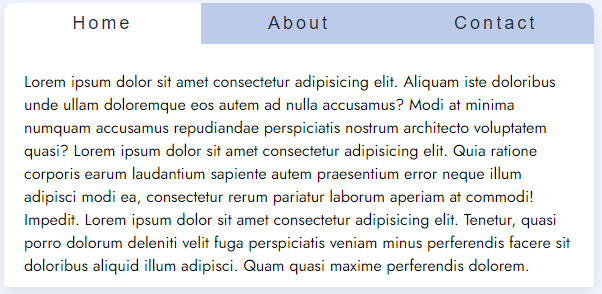

-------------------------------------
### DOM Exercise 1
-------------------------------------

Implement the tabs widget. When you click on a tab the content associated with that tab should be shown.

-------------------------------------
### DOM Exercise 2
-------------------------------------

Add the "Due date" input field to the Tasks exercise.
The date should be added to the array "arraysTasks" and to localStorage.
The completed state of the task should also be added to the array and to localStorage.

Use a table with three columns (Task, Due date and Completed) to show the tasks provided by the user.
When the user clicks on a task line the task should change to completed, or vice-versa. Use a confirm method to ask for confirmation from the user.

Validate the input provided by the user:
- the task should have a minimum of 3 characters
- only letters (upper or lowercase) and spaces are allowed
- repeated tasks are not allowed
- the Due date field is a required field

Show the error messages using an alert, or use a dialog box designed by you.

Create a new field (and a new button) to allow searches.
Use the same table to present the search results.
If there are no results, show a message using a dialog box.
Add a "Clean Search" button to show the original list.

