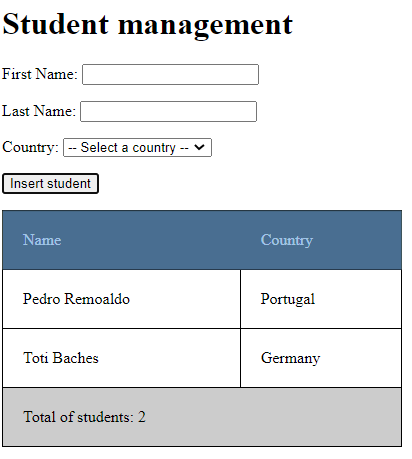

-------------------------------------
### DOM Exercise 1
-------------------------------------

Create 2 buttons (- and +) that allow the user to increment and decrement a value that should is visible to the user.

-------------------------------------
### DOM Exercise 2
-------------------------------------

Create an array with country's names. Create a button that, when pressed, randomly shows a country's name.

-------------------------------------
### DOM Exercise 3
-------------------------------------

Using the images from the gallery exercise, create an array with the names of those images.

Initially, show the first image.

Create two buttons, < and >, that allow the user to show the previous image or the next image.

When the user is at the last image, when he presses the > button the first image should be shown.

-------------------------------------
### DOM Exercise 4
-------------------------------------

Create a form with 2 fields, firstName and lastName. We the user clicks the submit button you should show the full name using an alert dialog box.

-------------------------------------
### DOM Exercise 5
-------------------------------------

Add a "country" select list to the previous example. This list should get the options' values from an array.

The 3 fields (first name, last name and country) are required, so the user must provide a value for each of them - should an error message if that doesn't happen.

We the user clicks the submit button show the fields' content inside a table.

Initially, when the table does not have any rows, it should not be visible.

After showing the new student on the table, the content of the 3 form fields should be cleaned, and the cursor show be placed inside the first field.

-------------------------------------
### DOM Exercise 6
-------------------------------------

Implement the tabs widget. When you click on a tab the content associated with that tab should be shown.

-------------------------------------
### DOM Exercise 7
-------------------------------------

Add the "Due date" input field to the Tasks exercise.
The date should be added to the array "arraysTasks" and to localStorage.
The completed state of the task should also be added to the array and to localStorage.

Use a table with three columns (Task, Due date and Completed) to show the tasks provided by the user.
When the user clicks on a task line the task should change to completed, or vice-versa. Use a confirm method to ask for confirmation from the user.

Validate the input provided by the user:
- the task should have a minimum of 3 characters
- only letters (upper or lowercase) and spaces are allowed
- repeated tasks are not allowed
- the Due date field is a required field

Show the error messages using an alert, or use a dialog box designed by you.

Create a new field (and a new button) to allow searches.
Use the same table to present the search results.
If there are no results, show a message using a dialog box.
Add a "Clean Search" button to show the original list.

